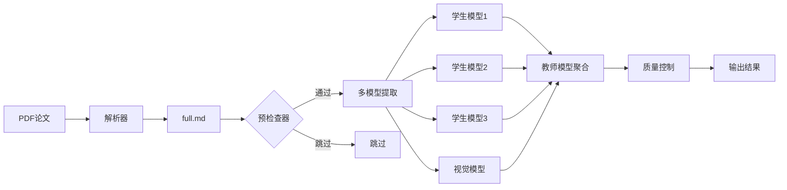

# 系统架构说明

## 架构概述

MycoExtract 采用三层架构设计，实现从科学文献中自动提取霉菌毒素降解酶动力学数据。

## 核心组件

### 1. 数据源层 (Data Source Layer)

```
PDF文献 → 解析器 → Markdown结构化数据
                  ↓
            full.md + images/
```

### 2. 处理层 (Processing Layer)

#### Phase 0: 预检查器 (PaperLevelPrechecker)
- **输入**: 论文目录
- **处理**: 关键词匹配
- **输出**: 通过/跳过决策
- **性能**: 0.3ms/论文

#### Phase 1: 多模型提取器 (MultiModelExtractor)

**学生模型 (并行)**:
- Kimi (Moonshot): 长上下文处理
- DeepSeek: 技术准确性
- GLM-4.7: 双语支持

**视觉模型**:
- GLM-4.6V: 图表识别

#### Phase 2: 聚合与质量控制 (Aggregation & QC)

**教师模型 (GPT-5.1)**:
- 冲突解决
- 数据融合
- 质量评估

### 3. 输出层 (Output Layer)

```
combined_results.json  ← 主要结果
quality_report.json    ← 质量分析
statistics.json        ← 统计信息
```

## 数据流



## 关键算法

### 置信度评分

```python
def calculate_confidence(record):
    # 核心要素
    has_kinetics = has_km or has_kcat or has_kcat_km
    has_degradation = has_degradation_efficiency

    # 重要要素 (6个独立)
    important_count = sum([
        has_kinetics,
        has_degradation,
        has_products,
        has_toxicity_change,
        has_organism_info,
        has_conditions
    ])

    # 奖励要素 (最多3个)
    bonus_count = sum([
        has_ec_number,
        has_full_name,
        has_sequence_id
    ])

    # 评分规则
    if has_kinetics and important_count >= 3 and bonus_count >= 1:
        return 3
    if has_degradation and has_products and has_toxicity_change:
        return 3
    if (has_kinetics or has_degradation) and important_count >= 1:
        return 2
    return 1
```

### 两步底物过滤

```python
def filter_substrate(substrate):
    # Step 1: 列表匹配
    if substrate in KNOWN_MYCOTOXINS:
        return True

    # Step 2: LLM判断
    result = llm_ask(f"Is {substrate} a mycotoxin?")
    return result == "Yes"
```

## 性能优化

1. **预检查机制**: 30%成本节省
2. **并发处理**: 支持多论文并行
3. **智能缓存**: 避免重复API调用
4. **增量处理**: 失败重试机制

## 扩展性设计

### 添加新的学生模型

```python
# 在 src/llm_clients/providers.py 中添加
def build_new_student_client():
    return build_client("new_provider", "new-model")

# 在 scripts/run_extraction.py 中使用
new_client = build_new_student_client()

pipeline = EnhancedExtractionPipeline(
    new_student_client=new_client,
    ...
)
```

### 自定义提取规则

编辑 `prompts/` 目录下的提示词文件：
- `prompts_extract_from_text.txt`
- `prompts_extract_from_table.txt`
